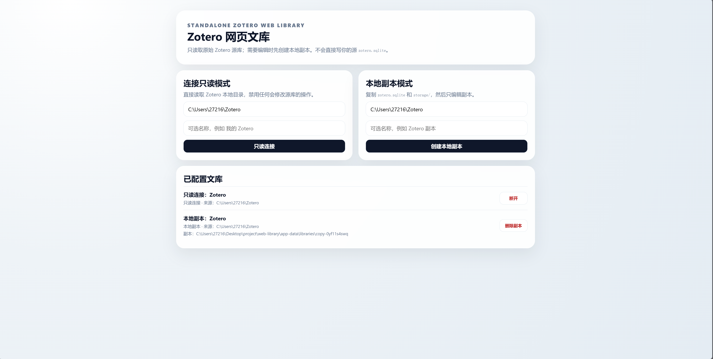
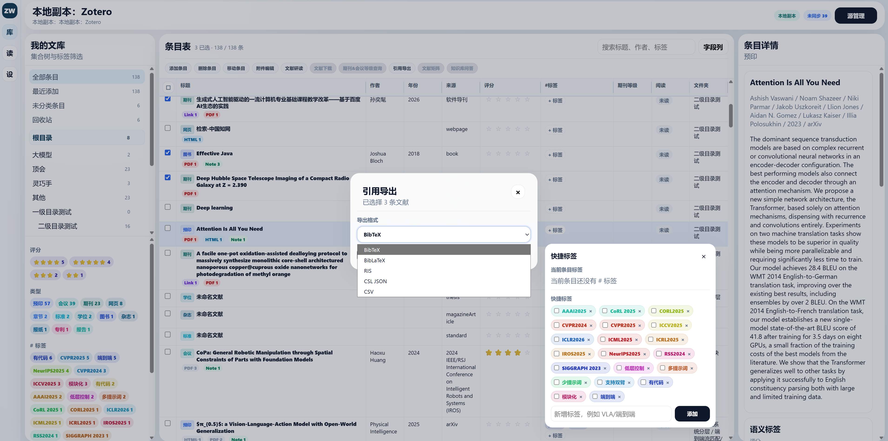
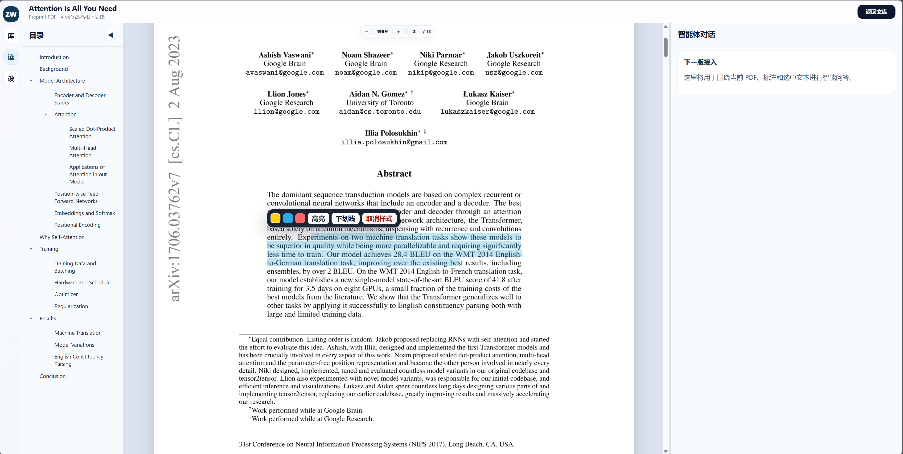

# Zotero Web Library

一个面向本地 Zotero 文库的 Web 工作台。它不是简单的“网页版文献列表”，而是把文库浏览、附件阅读、知识库构建、RAG 检索、多源外部检索、文献矩阵抽取、以及综述写作串成一套本地优先的研究工作流。

项目当前默认有两种使用方式：

- `只读源库模式`：直接连接现有 Zotero 数据目录，只读浏览，不修改源库。
- `本地副本模式`：把 `zotero.sqlite + storage/` 复制到 `app-data/libraries/<library-id>/` 下，后续编辑只落在副本上。

## 界面预览

早期文库与阅读界面：







当前知识库 / 矩阵 / 写作界面：

知识库 / 文献矩阵 / RAG 对话：


综述写作工作台：


## 当前核心能力

### 1. 文库与条目管理

- 三栏式文库界面：左侧集合树与筛选，中间条目表，右侧条目详情。
- 支持本地只读连接、服务端路径复制、副本上传三种入库方式。
- 支持集合创建、重命名、移动、删除。
- 支持条目批量移动、删除、回收站处理。
- 支持条目字段编辑、结构化字段写回、标签编辑、评分、阅读状态维护。
- 支持 BibTeX / BibLaTeX / RIS / CSL JSON / CSV 导出。
- 支持通过 DOI、PMID、arXiv、ISBN 等标识符导入条目，也支持粘贴 RIS / BibTeX / CSL JSON / PubMed XML。

### 2. 附件与阅读

- 支持 PDF、HTML、图片、链接等附件展示与管理。
- 支持上传本地文件附件、添加 URL 附件、重命名附件、删除附件。
- 内置 PDF.js 阅读器，支持目录导航、连续滚动、可调三栏布局。
- 支持 Zotero 原生 annotation 读写，当前重点支持高亮与下划线。
- 支持单篇文献阅读对话，围绕当前条目进行 AI 问答。

### 3. 知识库与 RAG

- 一个文库下可以维护多个知识库。
- 每个知识库可维护自己的文献范围。
- 支持把文库元数据、笔记、附件解析结果切 chunk 后写入本地 RAG 索引。
- 支持知识库级检索、关键词检索、元数据检索、chunk 阅读。
- 支持围绕当前知识库进行证据型对话。
- RAG 索引本地落在每个文库自己的 `rag.sqlite`，不依赖外部向量数据库。

### 4. 文献矩阵

- 知识库页可以为当前知识库定义矩阵字段。
- 支持手动新增字段，也支持 AI 推荐字段。
- 支持批量运行矩阵抽取，把每篇文献写成结构化矩阵记录。
- 矩阵结果已作为后续综述写作的输入；接入知识库 Agentic RAG 对话仍待补齐。
- 当前矩阵数据按知识库隔离存储。

### 5. 多源检索与候选导入

- 内置多源检索与 guided search 流程。
- 内置公共源包括：`Crossref`、`arXiv`、`PubMed`、`Semantic Scholar`、`DBLP`、`OpenReview`、`DataCite`、`Europe PMC`、`Figshare`、`OSF`、`OpenML`、`GitHub`、`GitLab`、`Hugging Face`、`Zenodo`、`Brave` 等。
- 支持批量检索、AI 评分、覆盖度分析、候选去重、候选导入。
- 支持文库级自定义检索源：
  - 本地文件源
  - HTTP JSON 源
  - SQLite 源
  - Manifest 源
  - 自定义 source 配置
- 支持 readiness / onboarding / tuning / report / config bundle 这整套接入与验收链路。

### 6. 综述写作

- 写作页已经是一个完整的四阶段工作台：
  1. `拟定主题`
  2. `大纲生成`
  3. `内容核对`
  4. `综述生成`
- 写作页要求先选择知识库，再选择该知识库下的文献。
- 选中文献会同步生成当前写作使用的 `writing_sources.csv`。
- AI 会围绕当前知识库矩阵、写作 CSV、本地 `outline.md` / `survey.md` 工作。
- 写作状态、映射关系、聊天状态都按“当前文库自己的 writing 目录”隔离存储。
- 当前实现已经显式避免跨文库串写。

## 页面结构

### 源管理页 `/`

- 配置只读源库
- 从服务端路径创建本地副本
- 从浏览器上传文库目录创建本地副本
- 管理已有文库

### 文库页 `/library/<library_id>`

- 集合树、条目表、详情面板
- 标签、评分、阅读状态、字段编辑
- 附件与导入导出操作

### 多源检索页 `/library/<library_id>/features`

- 外部检索源管理
- guided search / query plan / batch job / candidate import
- 检索报告与配置打包

### 知识库页 `/library/<library_id>/knowledge`

- 知识库列表
- 矩阵字段定义与矩阵表格
- RAG 检索与知识库对话

### 阅读页 `/library/<library_id>/reader`

- PDF 阅读
- Zotero annotation
- 单篇文献 AI 对话

### 写作页 `/library/<library_id>/writing`

- 写作文献选择
- 本地大纲编辑
- 小节-文献映射卡片
- 本地综述 Markdown 生成与维护

## 本地存储结构

默认情况下，应用把自己的数据保存在 `./app-data/`：

```text
app-data/
  app.sqlite
  libraries/
    <library-id>/
      source.json
      zotero.sqlite
      storage/
      rag.sqlite
      matrix/
        <knowledge-base-id>/
          fields.json
          items/
            <item-key>.json
      writing/
        writing_state.json
        writing_sources.csv
        outline.md
        writing_section_mappings.json
        survey.md
        writing_chat.json
        writing_chat_state.json
```

补充说明：

- `app.sqlite`：应用自己的元数据数据库，保存文库注册信息、偏好设置、检索任务、custom sources、config bundle 等。
- `libraries/<library-id>/zotero.sqlite`：本地副本模式下的 Zotero 数据库。
- `libraries/<library-id>/storage/`：本地副本模式下的附件目录。
- `libraries/<library-id>/rag.sqlite`：当前文库自己的 RAG 索引与知识库关系表。
- `libraries/<library-id>/matrix/<knowledge-base-id>/`：当前文库下、按知识库隔离的矩阵字段与矩阵结果。
- `libraries/<library-id>/writing/`：当前文库唯一的综述写作工作区。

## 写作工作区约定

当前代码采用“一个文库一个写作工作区”的约定：

- 一个文库可以有多个知识库。
- 一个文库只有一个写作工作区目录：`writing/`。
- 写作工作区里的核心文件组包括：
  - `writing_state.json`
  - `writing_sources.csv`
  - `outline.md`
  - `writing_section_mappings.json`
  - `survey.md`
  - `writing_chat.json`
  - `writing_chat_state.json`

写作页切换知识库时，文献选择来自该知识库；但写作文件始终落在当前文库自己的 `writing/` 目录，而不会写到别的文库。

## 数据原则

- Zotero 原生文献信息以 `zotero.sqlite` 为准。
- 只读模式不写源库。
- 编辑模式只写本地副本，不直接改用户真实 Zotero 库。
- 应用新增状态尽量落在 `app.sqlite`、`rag.sqlite`、`matrix/`、`writing/` 等自己的层，而不是篡改 Zotero schema。

更细的数据映射说明见：

- [docs/data-mapping.md](docs/data-mapping.md)
- [docs/zotero-translators.md](docs/zotero-translators.md)

## 环境要求

- Python `3.12`
- [uv](https://docs.astral.sh/uv/)

仓库里的 `.python-version` 已固定为 `3.12`。

## 本地启动

```powershell
uv sync
uv run python -m zotero_web_library.web
```

启动后访问：

```text
http://127.0.0.1:8686
```

常用环境变量：

```powershell
$env:WEB_LIBRARY_DATA_DIR="C:\path\to\app-data"
$env:WEB_LIBRARY_HOST="127.0.0.1"
$env:WEB_LIBRARY_PORT="8686"
$env:WEB_LIBRARY_DEBUG="1"
$env:WEB_LIBRARY_SERVER_ROOTS="C:\"
uv run python -m zotero_web_library.web
```

其中：

- `WEB_LIBRARY_DATA_DIR`：应用数据目录
- `WEB_LIBRARY_SERVER_ROOTS`：限制“服务端路径选择器”可浏览的根目录

## Docker 启动

如果需要构建带 demo 数据的镜像，先拉取 LFS 文件：

```powershell
git lfs pull
```

然后启动：

```powershell
docker compose up --build
```

访问：

```text
http://localhost:8686
```

默认情况下，容器会把 `demo-data/` 复制到 volume 中作为初始演示数据。

## 测试

运行全部测试：

```powershell
uv run pytest
```

运行写作相关测试：

```powershell
uv run pytest tests/test_writing.py
```

运行不依赖外部 API 的 Agentic RAG 确定性基线：

```powershell
uv run python -m zotero_web_library.rag_eval_cli run `
  --suite evals/agentic_rag/smoke-v1.json `
  --synthetic-corpus evals/agentic_rag/synthetic-corpus-v1.json `
  --target retrieve `
  --output-dir evals/agentic_rag/reports `
  --report-stem baseline-retrieval-v1
```

评测集格式、完整 Agent 评测和真实文库评测方式见 [evals/agentic_rag/README.md](evals/agentic_rag/README.md)。

## 代码结构

```text
src/zotero_web_library/
  web.py              Flask 入口与 HTTP API
  zotero_adapter.py   Zotero SQLite / storage 访问层
  app_store.py        应用元数据库与任务状态
  writing.py          综述写作存储层
  rag/                知识库、chunk、RAG 索引与检索
  retrieval/          多源检索、provider、导入与报告
  codex_agent/        阅读/矩阵/写作智能体编排
  templates/          页面模板
  static/             前端脚本与样式
```

## 当前状态

这已经不是一个“只看 Zotero”的小工具，而是一套围绕本地文库展开的研究工作台。当前最完整、最值得继续迭代的几条主链路是：

- `文库浏览 -> 附件阅读 -> 阅读对话`
- `文库 -> 多源检索 -> 候选导入`
- `文库 -> 知识库 -> 文献矩阵 -> RAG 对话`
- `知识库 -> 综述写作 -> 大纲/映射/正文`

如果你准备继续扩展功能，建议先从这几块入手：

- `src/zotero_web_library/web.py`
- `src/zotero_web_library/rag/store.py`
- `src/zotero_web_library/writing.py`
- `src/zotero_web_library/static/app.js`
- `src/zotero_web_library/static/knowledge.js`
- `src/zotero_web_library/static/writing.js`
